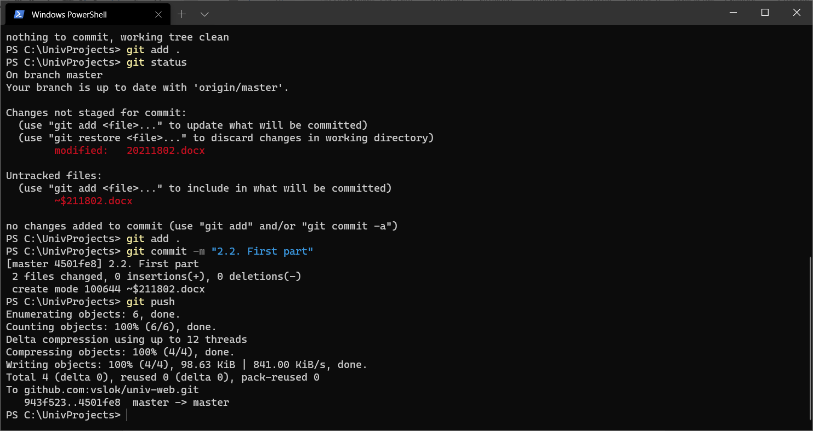
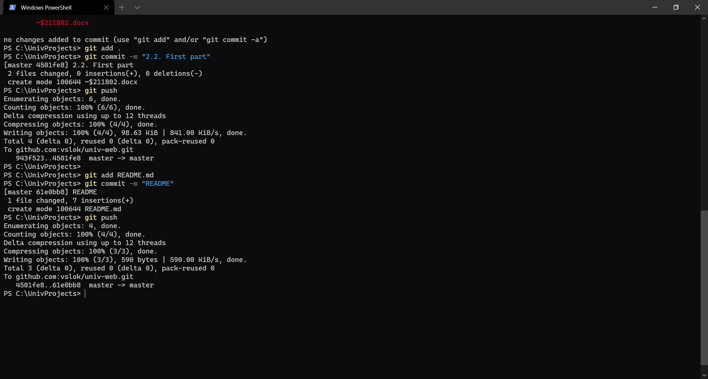
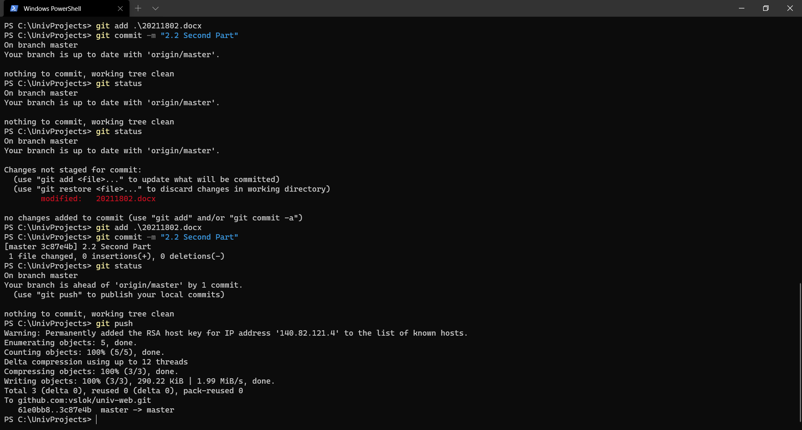
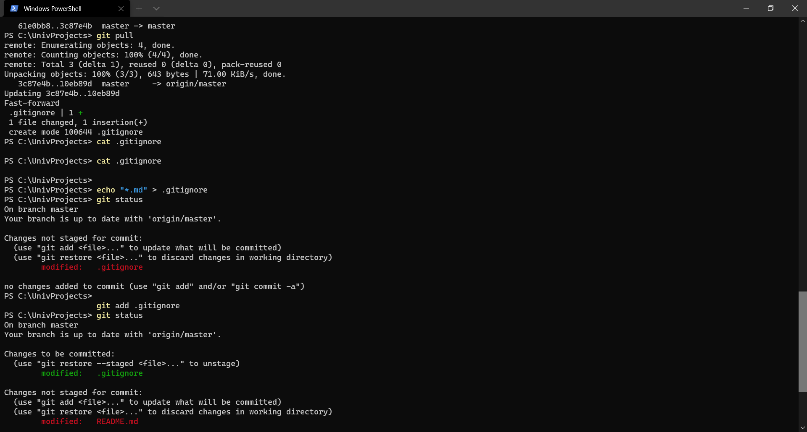
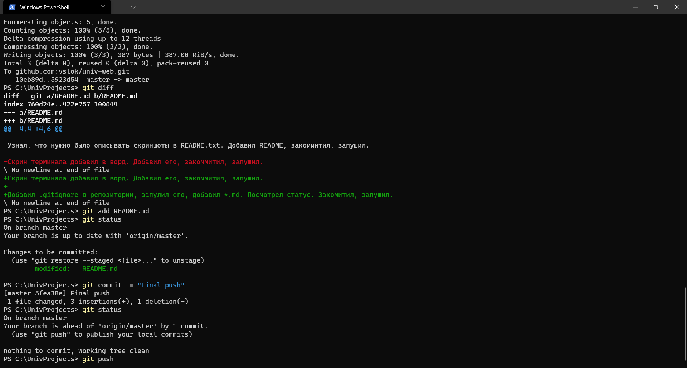
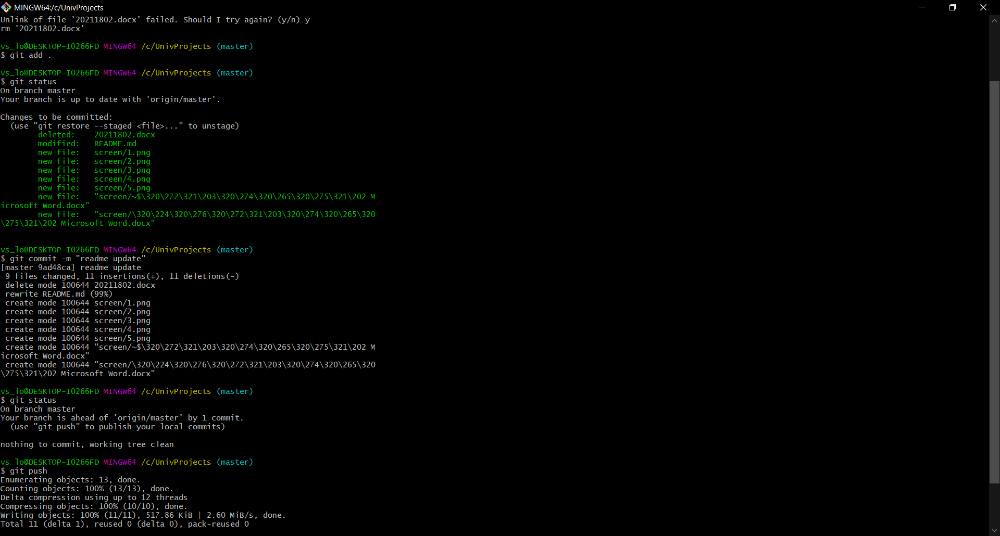

Добавил вордовский файл. (Добавлял все, но он просто один). Сделал коммит. Запушил.

Файл был пустой. Добавил скриншот терминала. Добавил файлы. Закоммитил. Запушил.

Узнал, что нужно было описывать скриншоты в README.txt. Добавил README, закоммитил, запушил.

Скрин терминала добавил в ворд. Добавил его, закоммитил, запушил.

Добавил .gitignore в репозитории, запулил его, добавил *.md. Посмотрел статус. Закомитил, запушил.

Узнал, что картинки должны были быть в в readme. Удалил вордовский файл, сделал папку с картинками. Добавил картинки в README. Закомитил, запушил.

